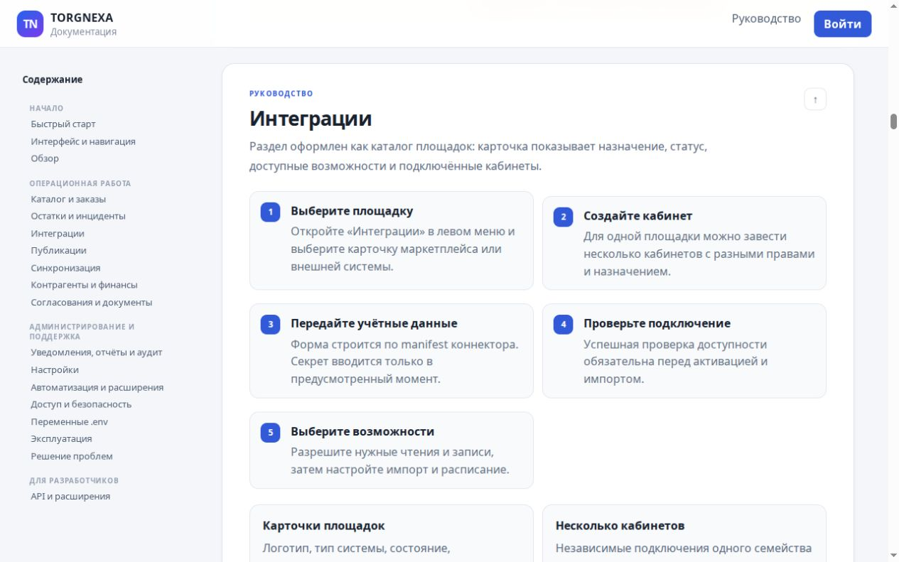

# TORGNEXA — open-source commerce platform for marketplaces and online stores

[Русская версия](README.ru.md)

TORGNEXA is an open-source, self-hosted commerce platform for teams that sell
through marketplaces, online stores and other sales channels. It helps keep
product catalogs, prices, inventory and orders in sync, while giving the team
one place to manage fulfillment, returns and settlement reconciliation.

The project is for businesses that want to run their own commerce operations,
connect different sales channels and build on a public API instead of locking
their workflow to one provider.



*Current integrations screen with marketplace and external system connections.*

## What can you do with TORGNEXA?

- keep product information, prices and stock consistent across sales channels;
- bring marketplace and storefront orders into a common workflow;
- connect fulfillment, delivery, returns and settlement data;
- automate scheduled synchronization and check for differences between local
  and remote data;
- extend the platform with connector SDKs, REST API, webhooks and plugins.

## Integrations

The repository contains connector work for marketplaces including Wildberries,
Ozon, Yandex Market, Megamarket, Magnit Market and AliExpress RU. Storefront
connectors include Shopify, WooCommerce, Magento, OpenCart and Shopware. The
current marketplace coverage and the exact admitted capabilities are listed in
the [marketplace connector guide](docs/connectors/marketplaces.md); source code
and provider-specific tests live under [`connectors/`](connectors/).

The connector model also covers ERP, social, payment and logistics providers.
Every integration declares what it can do, keeps provider details at the
boundary and is tested against a common contract. This makes a connector's
actual coverage visible instead of presenting every provider as fully
interchangeable.

## What works today

The repository is usable for local development and connector work. The current
working baseline includes:

- a Docker Compose Community environment with the API, web frontend, worker,
  scheduler, MCP service, PostgreSQL, Kafka and Valkey;
- a web interface for the dashboard, integration catalog, documentation and
  settings, with tenant-scoped API access;
- an OpenAPI-backed REST API and generated Go, Python and TypeScript SDKs;
- connector manifests, capability checks and deterministic conformance tests;
- local Docker smoke coverage for OpenCart, WooCommerce and PrestaShop,
  including catalog, inventory and selected product/order operations;
- documented marketplace and storefront connector surfaces for providers such
  as Wildberries, Ozon, Yandex Market, Shopify, WooCommerce and Shopware.

The exact status matters: a provider can be read-only or health-check-only, and
a passing SDK conformance report is not the same as qualification against a
real merchant account. See the [validation summary](VALIDATION_REPORT.md) and
the [marketplace capability matrix](docs/connectors/marketplaces.md) before
planning a production integration.

## Project status

TORGNEXA is in active development. The Community deployment is available for
local evaluation and development. Before using it in production, qualify the
connectors, data flows and deployment topology that you plan to use.

## Run it locally

You need Docker with Compose v2 and a local checkout of the repository.

```bash
make community-init
make community-up
make community-status
```

The Community stack starts the local services needed to explore the platform.
For a browser smoke test, run:

```bash
make community-e2e
```

See the [environment variables guide](docs/deployment/environment-variables.md)
for configuration and secret rotation. Deployment guides are available for the
[Community Docker setup](docs/deployment/093-community-docker-deployment.md)
and [production SSH workflow](docs/deployment/production-ssh-deploy.md).

## Project layout

- `docs/` — product, architecture and operational documentation;
- `adr/` — decisions that record important architectural choices;
- `contracts/` — API, event, webhook, plugin and JSON Schema contracts;
- `connectors/` — marketplace, storefront, ERP, social, payment and logistics
  integrations;
- `internal/` — application, domain and platform code;
- `frontend/` — the web application;
- `tasks/` — implementation tasks and execution plans.

## Architecture in brief

TORGNEXA starts as a modular monolith in Go. PostgreSQL is the source of
operational data; events go through the EventBus and Kafka; analytics and
history are kept separately; cache state is not used as business data.

Provider-specific behavior belongs in connectors. The core works through
interfaces and declared capabilities rather than checks for provider names.
The architectural baseline is described in
[`docs/01-architecture.md`](docs/01-architecture.md) and frozen in
[`docs/54-architecture-freeze-v1.md`](docs/54-architecture-freeze-v1.md).

## Contributing

Start with the [product scope](docs/00-product-scope.md),
[architecture](docs/01-architecture.md) and
[module boundaries](docs/03-module-boundaries.md). If you are changing a
connector, read its manifest, provider specification and conformance tests.

For a normal code change, run:

```bash
gofmt -w <changed-go-files>
go test ./...
go vet ./...
./scripts/check-contracts.sh
```

The tracked [`VALIDATION_REPORT.md`](VALIDATION_REPORT.md) contains a short
validation summary. Detailed runtime and release evidence belongs in CI
artifacts or `qualification/evidence/`.

## License

TORGNEXA is distributed under the Apache License 2.0. See [`LICENSE`](LICENSE).
